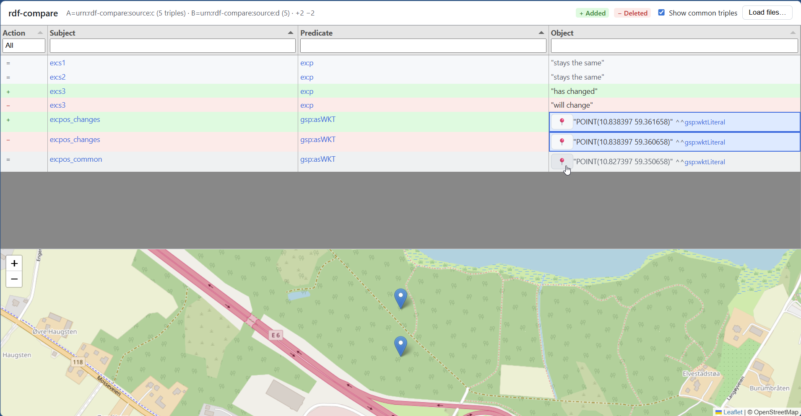

# rdf-compare

A small, fast CLI to compute the diff between two RDF files. The output is itself an
RDF dataset — a [TriG](https://www.w3.org/TR/trig/) or
[N-Quads](https://www.w3.org/TR/n-quads/) document containing two named graphs:

- the named graph for **file A** holds triples present in A but not in B;
- the named graph for **file B** holds triples present in B but not in A.

Triples that appear in both files are omitted (they are the "common core").

## Features

- **Streaming.** File B is streamed; only file A is loaded into memory (as a hash
  set of triples), so peak memory is `O(|A|)`.
- **Multiple input formats** auto-detected from the extension:
  N-Triples (`.nt`), Turtle (`.ttl`), RDF/XML (`.rdf`, `.owl`, `.xml`),
  TriG (`.trig`), N-Quads (`.nq`).
- **Transparent gzip** for any input ending in `.gz`.
- **Two output formats:** TriG (default) and N-Quads.
- **Filename-derived graph IRIs** (`urn:rdf-compare:source:<basename>`) with
  automatic `:1` / `:2` disambiguation when both files share a basename.
- **CI mode** (`--ci`) exits non-zero when any difference is found.
- **Blank-node aware.** When either input contains blank nodes, both sides are
  canonicalised with the [W3C RDFC-1.0](https://www.w3.org/TR/rdf-canon/)
  algorithm before the set-diff, so isomorphic sub-graphs cancel regardless of
  the bnode labels used. Pass `--ignore-blank-nodes` to opt out and skip every
  triple touching a bnode instead.
- **Quad-aware.** N-Quads and TriG inputs preserve their named graphs; the diff
  is then written as two parallel files (one per side) since RDF cannot nest
  named graphs.
- **Diff statistics** (`--stats <FILE>`) — a JSON summary on top of the
  triple-level diff: totals, per-predicate and per-class (`rdf:type`)
  breakdowns, and the subjects that were added, removed or modified.
- **Web viewer** (`--view` / `serve` subcommand) — explore the diff in an
  interactive browser UI with a statistics summary panel, filtering, sorting,
  prefix-shortened IRIs, and a Leaflet map for `geo:wktLiteral` cells.

## Install

From source (requires a stable Rust toolchain):

```sh
cargo install --path .
```

Or, once published:

```sh
cargo install rdf-compare
```

## Usage

### Diff (default)

```sh
rdf-compare <FILE_A> <FILE_B> [OPTIONS]
```

```sh
# Diff two Turtle files, write TriG to stdout
rdf-compare a.ttl b.ttl

# Cross-format diff, write N-Quads to a file
rdf-compare snapshot-old.nt.gz snapshot-new.ttl \
    --output-format nq -o diff.nq

# Also write diff statistics as JSON
rdf-compare a.ttl b.ttl -o diff.trig --stats stats.json

# Use in CI: exit 1 when files differ
rdf-compare expected.ttl actual.ttl --ci --quiet -o /dev/null
```

### Web viewer

Open the result in a browser immediately after diffing:

```sh
rdf-compare a.ttl b.ttl --view
```

Screenshot:


Or start an interactive server (files can be selected in the browser):

```sh
# Empty viewer — load files interactively in the browser
rdf-compare serve

# Pre-load two source files
rdf-compare serve --file-a a.ttl --file-b b.ttl

# Pre-load a previously saved diff file
rdf-compare serve --diff diff.trig

# Bind to a fixed port and skip auto-opening the browser
rdf-compare serve --file-a a.ttl --file-b b.ttl --bind 127.0.0.1:8080 --no-open
```

The viewer runs entirely offline — all assets (Tabulator, Leaflet, wellknown)
are bundled inside the binary.

### Options — diff

| Flag | Description |
| --- | --- |
| `--format-a <FMT>` | Force input format for file A (`nt`, `ttl`, `rdf`/`xml`, `trig`, `nq`). |
| `--format-b <FMT>` | Force input format for file B. |
| `-o`, `--output <FILE>` | Write output to `FILE` instead of stdout. |
| `--output-format <FMT>` | `trig` (default) or `nq`. |
| `--graph-a <IRI>` | Override the named-graph IRI for "only-in-A" triples. |
| `--graph-b <IRI>` | Override the named-graph IRI for "only-in-B" triples. |
| `--stats <FILE>` | Write diff statistics as JSON to `FILE` (`-` for stdout, requires `-o`). See [Statistics](#statistics). |
| `--quiet` | Suppress the summary line on stderr. |
| `--ci` | Exit with code 1 if any differences are found. |
| `--view` | Open the diff in the local web viewer after computing it. |
| `--no-open` | Do not auto-open the system browser (implies `--view`). |
| `--bind <ADDR>` | Bind address for the viewer (default: `127.0.0.1:0`). |
| `--ignore-blank-nodes` | Skip every triple touching a blank node instead of canonicalising. |

### Options — `serve` subcommand

| Flag | Description |
| --- | --- |
| `--file-a <FILE>` | First RDF file to pre-load (requires `--file-b`). |
| `--file-b <FILE>` | Second RDF file to pre-load (requires `--file-a`). |
| `--format-a <FMT>` | Force input format for file A. |
| `--format-b <FMT>` | Force input format for file B. |
| `--diff <FILE>` | Pre-load a saved diff file instead of recomputing (conflicts with `--file-a`/`--file-b`). |
| `--graph-a <IRI>` | Override the named-graph IRI for the A side. |
| `--graph-b <IRI>` | Override the named-graph IRI for the B side. |
| `--bind <ADDR>` | Bind address (default: `127.0.0.1:0`). |
| `--no-open` | Do not auto-open the system browser. |

### Exit codes

| Code | Meaning |
| --- | --- |
| `0` | Success (or, without `--ci`, completed even if differences exist). |
| `1` | `--ci` was set and at least one difference was found. |
| `2` | Error (I/O, parse, etc.). |

## Example output

Given:

```turtle
# a.ttl
@prefix ex: <http://example.org/> .
ex:s1 ex:p "v1" .
ex:s3 ex:p "vA" .
```

```turtle
# b.ttl
@prefix ex: <http://example.org/> .
ex:s1 ex:p "v1" .
ex:s3 ex:p "vB" .
ex:s4 ex:p "v4" .
```

`rdf-compare a.ttl b.ttl` produces:

```trig
<urn:rdf-compare:source:a> {
    <http://example.org/s3> <http://example.org/p> "vA" .
}
<urn:rdf-compare:source:b> {
    <http://example.org/s3> <http://example.org/p> "vB" .
    <http://example.org/s4> <http://example.org/p> "v4" .
}
```

…with a summary on stderr:

```
A: a.ttl  triples=2  only-in-A=1  skipped-bnodes=0
B: b.ttl  triples=3  only-in-B=2  skipped-bnodes=0
common=1
```

## Statistics

`--stats stats.json` writes a JSON summary next to the RDF diff. The web viewer
shows the same data in a collapsible **Summary** panel above the triple table
(click a predicate, class or subject there to filter the table on it; click it again to clear).

```json
{
  "totals":   { "a_total": 9, "b_total": 10, "common": 7, "added": 3, "removed": 2,
                "a_skipped_bnodes": 0, "b_skipped_bnodes": 0 },
  "subjects": { "a_total": 5, "b_total": 5, "affected": 3,
                "added": 1, "removed": 1, "modified": 1 },
  "predicates": [
    { "predicate": "http://example.org/age", "added": 1, "removed": 1,
      "a_total": 1, "b_total": 1, "common": 0 }
  ],
  "classes": [
    { "class": "http://example.org/Person", "instances_added": 1, "instances_removed": 0,
      "subjects_affected": 2, "triples_added": 3, "triples_removed": 1 },
    { "class": null, "instances_added": 0, "instances_removed": 0,
      "subjects_affected": 1, "triples_added": 0, "triples_removed": 1 }
  ],
  "top_subjects": [
    { "subject": "http://example.org/alice", "added": 1, "removed": 1, "status": "modified" }
  ]
}
```

- **totals** — triple counts per side, common, added (only in B) and removed
  (only in A).
- **subjects** — distinct subjects per side and those *affected* by the diff,
  split into *added* (subject only occurs in B), *removed* (only in A) and
  *modified* (occurs on both sides).
- **predicates** — one entry per predicate with at least one change, sorted by
  number of changes.
- **classes** — per `rdf:type` class of the affected subjects (types from A and
  B combined): new / removed instances (`rdf:type` triples added / removed),
  affected subjects, and added / removed triples on those subjects. A subject
  with several types counts towards each; untyped subjects are grouped under
  `"class": null`.
- **top_subjects** — the 50 subjects with the most changed triples.

When the viewer loads a saved diff file (`serve --diff`), only the changed
triples are known, so the A/B totals, `common` and subject `status` are
`null`, and classes come from the `rdf:type` triples inside the diff.

## How it works

1. Each input is parsed into a quad stream (triple inputs are tagged with the
   default graph).
2. If either side contains blank nodes, both sides are independently
   canonicalised using [W3C RDFC-1.0](https://www.w3.org/TR/rdf-canon/) so
   that isomorphic blank-node structures receive identical canonical labels.
3. A symmetric set-diff yields the *only-in-A* and *only-in-B* quad sets.
4. For triple-only inputs, the two sides are written into a single TriG / N-Quads
   file under per-side wrapper graph IRIs. For quad inputs, the original named
   graphs are preserved and the result is split across two parallel files
   (`<output>-a.<ext>` and `<output>-b.<ext>`) — quad inputs therefore require
   `--output`.

With `--ignore-blank-nodes`, step 2 is skipped and every triple touching a
blank node is dropped before the set-diff; the counts appear as
`skipped-bnodes` in the summary.

## Development

```sh
cargo test
cargo clippy --all-targets -- -D warnings
cargo fmt
```

## License

Apache-2.0.
